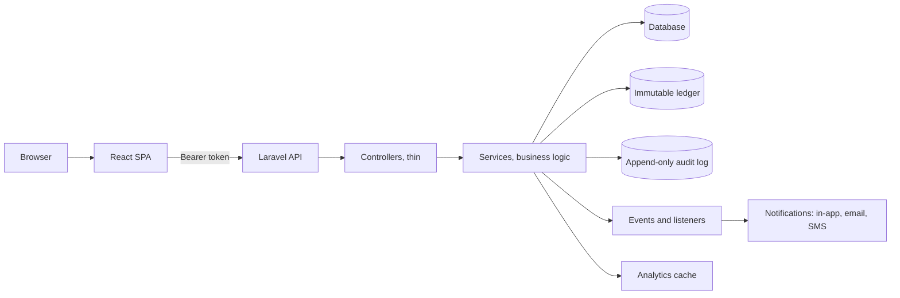

# Wyncrest

A full-stack rental property management platform with tenant, landlord, admin,
and super admin portals: property and unit catalogues, moderated public
listings, landlord-tenant contracts, an immutable financial ledger,
Stripe-backed rent payments, multi-channel notifications, and analytics, all
in one system of record.

| | |
|---|---|
| **Backend** | Laravel 12, PHP 8.2+, Sanctum (API tokens), Stripe, Twilio |
| **Frontend** | React 18, TypeScript, Vite, Tailwind CSS v4, React Router 7 |
| **Database** | SQLite by default; MySQL / PostgreSQL supported |
| **Tests** | 688 backend tests (PHPUnit, 2782 assertions), strict TypeScript + ESLint on the frontend |
| **License** | Pending (not yet chosen) |

Architecture, RBAC, and full contributor context live in [`CLAUDE.md`](CLAUDE.md)
and [`docs/`](docs/). This README is the fast path in; those are the deep dive.

---

## What it is

Wyncrest manages the full lifecycle of a rental: a landlord lists a property,
an admin moderates it, a tenant applies and signs a contract, rent generates
automatically on the ledger, the tenant pays through Stripe, and every
privileged action along the way is written to an append-only audit log. The
ledger cannot be edited or deleted after the fact, only corrected with a new
compensating entry, so the financial history is always trustworthy.

## Who it serves

| Capability | Public | Tenant | Landlord | Admin |
|---|:---:|:---:|:---:|:---:|
| Browse and search listings | Yes | Yes | Yes | Yes |
| Save listings | | Yes | | |
| Manage properties, units, listings | | | Yes (own) | |
| Moderate listings (approve/reject) | | | | Yes |
| Create and send contracts | | | Yes (own) | |
| Accept a contract | | Yes (own) | | |
| Terminate a contract | | Yes (own) | Yes (own) | Yes (any) |
| View the ledger | | Yes (own) | Yes (own) | Yes (all) |
| Pay rent | | Yes (own) | | |
| Apply late fees | | | | Yes |
| Grant per-landlord feature access | | | | Yes |
| Verify identity documents | | Yes (own) | Yes (own) | Yes (review) |
| Read audit logs | | | | Yes |
| Platform-wide analytics | | scoped | scoped | Yes |
| Manage admin access grants | | | | Yes (super admin) |

## Architecture



The API is the sole source of truth for authorization. The SPA's role-based
routing is a UX convenience, not a security boundary; every request is
enforced server-side through route middleware, FormRequest/Policy checks, and
service-level guards. Full detail, including the request lifecycle and a
payment sequence diagram, is in [`docs/ARCHITECTURE.md`](docs/ARCHITECTURE.md).

Money is stored as integer cents. `contracts` and `ledger_entries` use UUID
primary keys to prevent ID enumeration on financial records.

## Prerequisites

- PHP 8.2+, Composer 2
- Node 18+ and npm
- SQLite (bundled with PHP), or MySQL/PostgreSQL if you prefer

## Quick start

The one-command runner resets the database, seeds it, and boots the API,
queue, and SPA together:

```bash
./dev.sh            # development world (API :8000, SPA dev server :5173, HMR)
./dev.sh --prod     # production preview (built SPA on :3000, bootstrap admin only)
./dev.sh --help     # all flags, including --no-reset
```

Both modes reset the local database on every run, and the reset refuses to
run against anything but a local SQLite database.

### Manual backend setup

```bash
composer install
cp .env.example .env
php artisan key:generate
touch database/database.sqlite          # SQLite is the default connection
php artisan migrate:fresh --seed        # schema + controlled development world
php artisan wyncrest:seed:verify        # optional: verify the world and ledger
php artisan serve                       # http://localhost:8000
```

### Manual frontend setup

```bash
cd frontend
npm install
npm run dev                             # http://localhost:5173
```

The Vite dev server proxies `/api` to `http://localhost:8000`, so no CORS
setup is needed in development.

## Development mode vs. production mode

Seeding is mode-aware, and the two modes never overlap in what they create.

| | Development mode | Production mode |
|---|---|---|
| Trigger | `php artisan migrate:fresh --seed` (default) | `WYNCREST_SEED_MODE=production php artisan db:seed` |
| Creates | 1 admin, 5 landlords, 5 tenants, properties, contracts, ledger history, notifications, a full realistic world | Only a safe, idempotent baseline: reference data and an optional bootstrap admin |
| Demo accounts | Yes, listed below | Never |
| Fake ledger / contracts / tenants | Yes | Never |
| Safe to run repeatedly | Yes, resets local data | Yes, idempotent, will not duplicate |

Full mode-by-mode detail is in [`docs/SEEDING.md`](docs/SEEDING.md).

### Demo accounts (development mode only)

All use password `password` and the reserved `@wyncrest.test` domain. These
accounts are never created outside development mode.

| Role | Email | Notes |
|---|---|---|
| Admin | `admin@wyncrest.test` | System administrator |
| Landlord | `landlord.1@wyncrest.test` | Established: 1 property, 2 tenants, an available listing |
| Landlord | `landlord.2@wyncrest.test` | Landlord of the owing tenant; a listing in review |
| Landlord | `landlord.3@wyncrest.test` | Smaller: 1 property, 1 tenant, an available listing |
| Landlord | `landlord.4@wyncrest.test` | Listings-only (limited features), no tenants yet |
| Landlord | `landlord.empty@wyncrest.test` | Empty-state account, no properties |
| Tenant | `tenant.good1` to `good4@wyncrest.test` | Good standing, paid up, zero balance |
| Tenant | `tenant.owing@wyncrest.test` | Owes exactly one month (GH₵2,500) |

## Testing

```bash
# Backend: 688 tests (auth, RBAC/IDOR, contracts, ledger, payments,
# notifications, analytics, caching, security hardening)
php artisan test            # or: composer test

# Code style (PHP)
./vendor/bin/pint           # format
./vendor/bin/pint --test    # check only, no changes

# Frontend
cd frontend
npm run lint                # ESLint
npm run build                # tsc typecheck + production build
```

## Build and deploy

```bash
# Frontend production bundle -> frontend/dist
cd frontend && npm run build

# Backend production caches
php artisan config:cache && php artisan route:cache
```

Before deploying, work through the checklist at the bottom of
[`.env.example`](.env.example) and [`docs/DEPLOYMENT.md`](docs/DEPLOYMENT.md),
which also documents the live demo deployment as a concrete, real example.

## Documentation map

| Doc | Contents |
|---|---|
| [`CLAUDE.md`](CLAUDE.md) | Project memory: architecture, RBAC, security, standards, what must not change |
| [`docs/ARCHITECTURE.md`](docs/ARCHITECTURE.md) | System diagrams, request lifecycle, key architectural decisions |
| [`docs/API_REFERENCE.md`](docs/API_REFERENCE.md) | Every endpoint: auth, request fields, response shapes, enums |
| [`docs/SECURITY.md`](docs/SECURITY.md) | OWASP-aligned controls, audit findings, operational hardening |
| [`docs/DEPLOYMENT.md`](docs/DEPLOYMENT.md) | Deployment checklist and the real live demo deployment |
| [`docs/SEEDING.md`](docs/SEEDING.md) | Development vs. production seeding modes, demo account detail |
| [`docs/EXECUTION_PLAN.md`](docs/EXECUTION_PLAN.md) | Historical: the phased plan used to complete the project |

## Project layout

```
app/                 Laravel application (models, controllers, services, policies)
routes/              API and console route definitions
database/            migrations, factories, seeders
tests/               PHPUnit Feature/Unit tests, k6 load scripts
config/              framework and service configuration
frontend/            React + TypeScript SPA (the user-facing app)
docs/                architecture, API, security, deployment, seeding
CLAUDE.md            permanent project memory
```

## Security

Authorization is enforced server-side at three layers: route middleware,
policy/FormRequest ownership checks, and service-level guards for sensitive
operations. Financial records use UUID keys with an immutable ledger,
privileged actions write to an append-only audit log, and Stripe webhooks are
signature-verified with idempotent payment recording. See
[`docs/SECURITY.md`](docs/SECURITY.md) for the full model.

Found a vulnerability? Do not open a public issue; contact the maintainer
privately.

## Branding

The product name and every user-facing string are controlled from two central
files, not hardcoded in source:

| Layer | Config file | How to read it |
|---|---|---|
| Backend (PHP) | `config/brand.php` | `config('brand.display_name')`, `config('brand.short_name')`, etc. |
| Frontend (TS) | `frontend/src/config/brand.ts` | `import { brand, pageTitle } from '@/config/brand'` |
| HTML shell | `frontend/index.html` | A Vite plugin in `frontend/vite.config.js` replaces `%BRAND_NAME%` and friends |

To rename the product, set environment variables (`BRAND_*` on the backend,
`VITE_BRAND_*` on the frontend, documented in `.env.example`); do not hand-edit
brand strings across source files. All values default to `Wyncrest` and the
app works with zero configuration.

A small set of internal technical identifiers intentionally keep the
product's original working name, "Nexus", because renaming them risks
breaking storage keys, token prefixes, or cache formats for existing data:
the `nexus_` Sanctum token prefix, the `NexusCard` component name, `nexus.*`
localStorage keys, `--nexus-*` CSS custom properties, the `nexus-frontend`
npm package name, and the `nexus:{env}:...` analytics cache key format. None
of these are user-visible. See `CLAUDE.md` section 0 for the full rationale.

## License

License pending. No license has been chosen yet; all rights reserved until
one is added.
