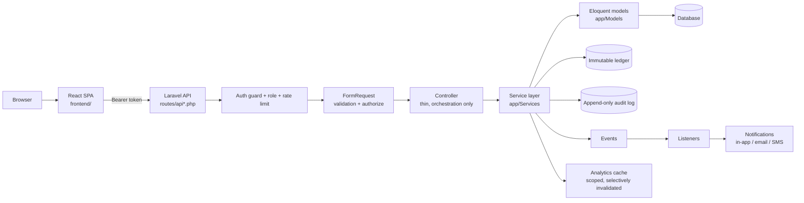
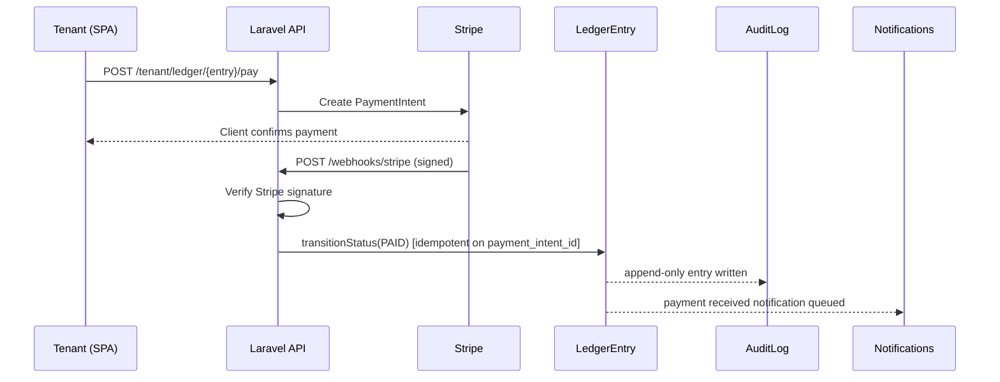

# Architecture

How Wyncrest is put together: the layers, the data flow, and the decisions
behind them. For product status and history, see the root `CLAUDE.md`.

## System overview

Wyncrest is a Laravel 12 API backend paired with a standalone React SPA. The
two are separate deployables that talk over JSON. There is no server-rendered
UI beyond a Laravel welcome page.



## Backend request lifecycle

Every write follows the same layered path, enforced in three places at once:
route middleware (coarse role gate), FormRequest/Policy (ownership and
resource-level rules), and service-level checks for sensitive operations.

```
Route (auth:sanctum + role guard + rate limit)
  -> FormRequest (validation + authorize())
    -> Controller (thin; orchestration only)
      -> Service (business logic, transactions)   app/Services
        -> Model (Eloquent; enums, scopes, invariants)   app/Models
      -> Policy (per-model authorization)   app/Policies
  -> Observer / Event / Listener (audit, notifications, cache invalidation)
```

Controllers never contain business rules. Validation never lives inline in a
controller. Side effects (audit logging, notifications, cache invalidation)
are wired through Observers, Events, and Listeners, not called directly from
controllers.

## Example flow: tenant pays rent



The ledger has no `update()`/`delete()` path. Status changes only happen
through `transitionStatus()`, and corrections are compensating entries, never
edits. See `CLAUDE.md` section 7 for the full data model rationale.

## Frontend architecture

The SPA lives entirely under `frontend/` (not the Laravel `resources/`
directory, which only serves a welcome page). It authenticates with Bearer
tokens (Sanctum personal access tokens, not cookie/SPA mode) and treats the
API as the sole source of truth for authorization: role-based routing in the
SPA is a convenience, never a security boundary.

```
frontend/src/
  api/         typed request functions per resource
  components/  shared UI (cards, layout, drawers, tables)
  context/     auth, theme, accent providers
  hooks/       data-fetching and UI hooks
  pages/       tenant/ landlord/ admin/ shared/ route screens
  lib/         format helpers, storage, endpoints
  types/       API response types
```

## Key architectural decisions

Decisions still in force today. Historical decisions that have since been
reversed by later product work are not listed here (see `CLAUDE.md` for the
live status of any feature).

| Decision | Rationale |
|---|---|
| Separate `users` and `admins` tables with separate auth guards | Makes privilege escalation impossible by construction; no role-filtering query can accidentally treat a tenant as an admin. |
| Feature gating via `features` / `landlord_features` tables, not `.env` flags | Feature availability is business data with an audit trail (who enabled what, when), not deployment config. |
| All emails and notifications triggered by events, handled by queued listeners | Decouples business logic from delivery; a controller never calls `Mail::send()` directly. |
| Audit logs are insert-only (no `updated_at`, no update path) | Guarantees the audit trail cannot be edited or backdated after the fact. |
| Soft deletes on user-generated content (users, properties, units, listings, conversations, messages) | Preserves legal and financial history; nothing that could matter for a dispute disappears on delete. |
| Ledger entries use UUID primary keys and are immutable | Prevents ID enumeration on financial records and makes tampering structurally impossible, not just policy-forbidden. |
| Service layer owns all business logic (`app/Services`) | Controllers stay thin and testable without the HTTP layer; business rules are discoverable in one place instead of scattered across controllers. |
| PHP enums for all state fields (statuses, types, cycles) | Type safety at the database boundary; invalid states cannot be assigned, and behavior methods (`isPublic()`, `canBeListed()`) live next to the states they describe. |

## Backend module map

| Path | Contents |
|---|---|
| `app/Models` | Eloquent models, one class per file |
| `app/Http/Controllers/{Admin,Landlord,Tenant,Analytics,Public}` | Thin controllers grouped by audience |
| `app/Http/Requests` | FormRequest validation classes |
| `app/Http/Middleware` | Role guards, rate limiting, security headers |
| `app/Policies` | Per-model authorization |
| `app/Services` | Business logic: ledger, payments, listings, notifications, analytics, audit, features |
| `app/Enums` | Type-safe domain values |
| `app/Events` / `app/Listeners` / `app/Observers` | Side-effect wiring |
| `app/Console/Commands` | Scheduled jobs (rent generation, overdue marking, digests) |
| `app/Support/Cache` | Analytics cache keys and selective invalidation |

For product scope, current status, and the full domain model, see the root
`CLAUDE.md`.
